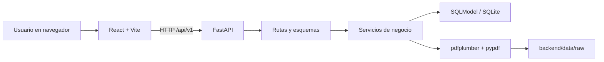
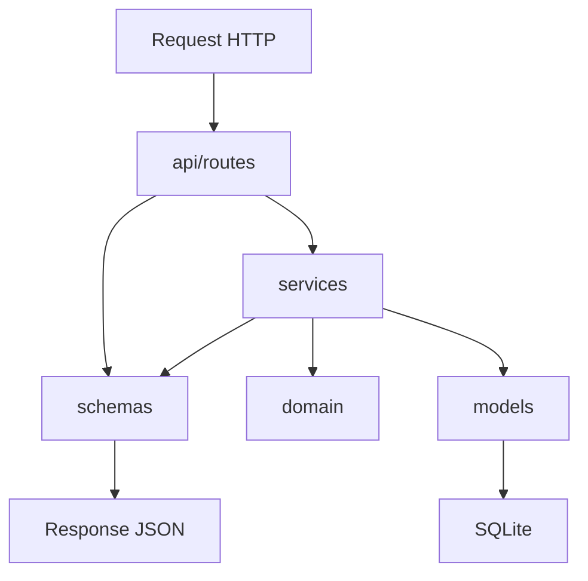
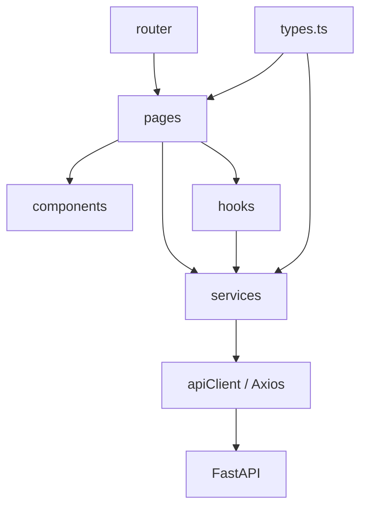

# Arquitectura y estructura

> Actualización de octubre de 2026: los detalles de autenticación, rutas `/app/*`, persistencia, pruebas y operación de la versión multiusuario están en [Despliegue de la beta](despliegue-beta.md). Este documento conserva el contexto funcional de la versión local anterior; no uses sus instrucciones antiguas de arranque/migración para producción.

## Vista general

La aplicacion sigue una arquitectura cliente-servidor local. React se encarga de
la interfaz y consume una API REST FastAPI. FastAPI valida contratos, ejecuta
servicios de negocio y persiste con SQLModel sobre SQLite. Los PDFs originales
se guardan en disco local.



En desarrollo, Vite sirve el frontend en el puerto `5173` y redirige `/api` a
FastAPI en `127.0.0.1:8000`. Si `VITE_API_URL` esta definido, Axios usa esa URL
en lugar del proxy.

## Arbol principal

```text
SoloFinanzas/
|-- backend/
|   |-- app/
|   |   |-- api/routes/       Endpoints FastAPI
|   |   |-- core/             Configuracion, motor y sesiones de base
|   |   |-- domain/           Enums, normalizacion y seleccion de parser
|   |   |-- models/           Tablas SQLModel
|   |   |-- schemas/          Contratos de entrada y salida
|   |   `-- services/         Logica de negocio
|   |-- scripts/              Reparacion y recategorizacion de datos
|   |-- tests/                Pruebas unittest
|   |-- data/                 SQLite, respaldos y PDFs; ignorado por Git
|   `-- requirements.txt
|-- frontend/
|   |-- src/
|   |   |-- assets/           Logos institucionales
|   |   |-- components/       UI reutilizable y modales
|   |   |-- hooks/            Carga del dashboard y formato CLP
|   |   |-- lib/              Axios y utilidades de fecha
|   |   |-- pages/            Pantallas por ruta
|   |   |-- router/           Layout y tabla de rutas
|   |   |-- services/         Adaptadores HTTP por recurso
|   |   `-- types.ts          Contratos y enums espejo del backend
|   |-- package.json
|   `-- vite.config.ts
|-- docs/                     Documentacion del proyecto
|-- README.md                 Presentacion y arranque rapido
`-- arci.md                   Guia especializada para nuevos bancos
```

## Responsabilidad de cada capa del backend



- `api/routes`: traduce HTTP a llamadas de negocio, inyecta la sesion y convierte
  excepciones conocidas en codigos HTTP.
- `schemas`: define payloads y respuestas independientes de la persistencia.
- `services`: contiene validacion contextual, consultas, transacciones y calculos.
- `models`: declara tablas y claves foraneas.
- `domain`: contiene vocabulario comun y funciones puras de normalizacion.
- `core`: resuelve configuracion, crea el motor y realiza inicializacion/siembra.

Las rutas no deben contener reglas financieras complejas. Los servicios no deben
depender de componentes HTTP. Los modelos de base no se envian directamente si
existe un esquema de respuesta.

## Responsabilidad de cada capa del frontend



- `router`: define URL, layout compartido, navegacion y salida 404.
- `pages`: compone datos, estado y acciones de cada seccion.
- `components`: implementa piezas visuales reutilizables.
- `hooks`: encapsula efectos reutilizables; actualmente dashboard y formato CLP.
- `services`: conoce endpoints y serializacion de formularios multipart.
- `lib/apiClient.ts`: configura URL base y normaliza errores FastAPI.
- `types.ts`: mantiene los contratos TypeScript alineados con los esquemas Python.

## Arranque de la aplicacion

1. Uvicorn importa `app.main:app`.
2. El `lifespan` ejecuta `init_db()` antes de aceptar solicitudes.
3. SQLModel crea tablas que falten.
4. Se normalizan tipos legacy `transfer` y `unknown` segun el signo del monto.
5. Se insertan categorias y reglas predeterminadas que no existan.
6. Se reconstruyen emparejamientos de transferencias internas.
7. React arranca en `main.tsx` y monta `RouterProvider`.
8. `RootLayout` entrega navegacion responsiva, encabezado, contenido y pie.

## Dependencias entre datos y archivos

- Base principal: `backend/data/solo_finanzas.db` por defecto.
- PDFs originales: `backend/data/raw/<checksum-corto>_<nombre-seguro>.pdf`.
- Respaldos creados por scripts: archivos `*.backup-*.db` junto a la base.
- Todo `backend/data/` esta ignorado por Git y debe respaldarse fuera del
  repositorio si sus datos son importantes.

## Decisiones arquitectonicas actuales

- SQLite simplifica la operacion local, pero limita concurrencia y despliegue.
- No hay ORM con relaciones navegables; los servicios consultan por claves.
- No hay herramienta de migraciones: `create_all` agrega tablas faltantes, pero
  no transforma esquemas existentes de forma general.
- La analitica avanzada se calcula en el navegador tras paginar y cargar todos
  los movimientos; el dashboard basico se calcula en backend.
- Los pares de transferencias se reconstruyen globalmente ante cambios
  relevantes, una estrategia simple pero costosa al crecer el volumen.

