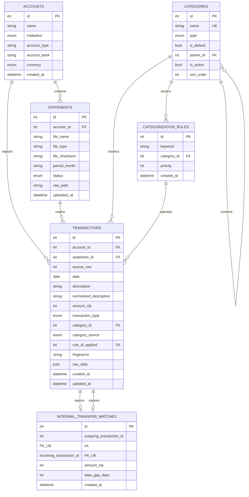

# Modelo de datos

## Persistencia

La base predeterminada es SQLite en `backend/data/solo_finanzas.db`. SQLModel
crea las tablas al iniciar. SQLite tiene claves foraneas activadas en cada
conexion, por lo que las relaciones impiden eliminaciones que dejarian datos
huerfanos.

Las migraciones SQLite aplicadas se registran en `schema_migrations`. Antes de
cada migracion pendiente se crea un respaldo `backup-migration` junto a la base.
`create_all()` sigue creando instalaciones nuevas y las migraciones actualizan
de forma explicita las bases existentes.

## Diagrama de relaciones

## `accounts`

| Campo | Tipo | Regla |
| --- | --- | --- |
| `id` | entero | Clave primaria. |
| `name` | texto | Nombre visible; el frontend exige no vacio. |
| `institution` | enum | Selecciona el parser de importacion. |
| `account_type` | texto | No esta restringido por enum en backend. |
| `account_last4` | texto nullable | Maximo cuatro caracteres en el esquema; UI exige cuatro digitos si existe. |
| `currency` | enum | Solo `CLP`. |
| `created_at` | datetime UTC | Orden estable de listado. |

Una cuenta no puede eliminarse si las claves foraneas encuentran cartolas o
movimientos relacionados.

## `statements`

| Campo | Tipo | Regla |
| --- | --- | --- |
| `id` | entero | Clave primaria. |
| `account_id` | FK | Cuenta propietaria. |
| `file_name` | texto | Nombre original del archivo. |
| `file_type` | texto | En importaciones PDF se guarda `pdf`. |
| `file_checksum` | texto nullable | SHA-256 del archivo; evita repetirlo en la misma cuenta. |
| `period_month` | texto nullable | Periodo `YYYY-MM`, indexado. |
| `status` | enum | `pending`, `processed` o `failed`; indexado. |
| `raw_path` | texto nullable | Ruta relativa habitual dentro de `data/raw`. |
| `uploaded_at` | datetime UTC | Indexado y usado para orden descendente. |

El checksum no tiene restriccion `UNIQUE` en la tabla. La unicidad por cuenta se
valida en el servicio antes de insertar.

## `transactions`

| Campo | Tipo | Regla |
| --- | --- | --- |
| `id` | entero | Clave primaria. |
| `account_id` | FK indexada | Cuenta del movimiento. |
| `statement_id` | FK | Cartola de origen; incluso la creacion manual exige una cartola. |
| `source_row` | entero nullable | Orden asignado durante importacion. |
| `date` | fecha indexada | Fecha financiera local. |
| `description` | texto | Descripcion limpia para mostrar. |
| `normalized_description` | texto indexado | Minusculas y puntuacion normalizada. |
| `amount_clp` | entero | Positivo ingreso; negativo egreso. |
| `transaction_type` | enum | `income` o `expense`. |
| `category_id` | FK nullable | Categoria vigente. |
| `category_source` | enum nullable | `rule`, `manual` o `default`. |
| `rule_id_applied` | FK nullable | Regla automatica que produjo la categoria. |
| `fingerprint` | texto indexado nullable | Huella de deduplicacion. |
| `raw_data` | JSON nullable | Actualmente conserva `source_id` y `source_line`. |
| `created_at` | datetime UTC | Momento de insercion. |
| `updated_at` | datetime UTC nullable | Usado principalmente por scripts operativos. |

`is_internal_transfer` solo aparece en el esquema de respuesta; se calcula
consultando `internal_transfer_matches`.

### Identidades de importacion

- Checksum de cartola: `SHA-256(bytes completos del PDF)`.
- Source key de candidato: `source_id` o, para compatibilidad, `source_line`.
- Fingerprint de movimiento:
  `SHA-256(account_id|fecha|descripcion_normalizada|monto)`.

La importacion preserva filas identicas reales dentro de una misma cartola
porque cada candidato recibe un `source_id` secuencial. Para movimientos ya
existentes, usa conteos por fingerprint: omite solo tantas ocurrencias como ya
existan y permite repeticiones adicionales legitimas.

## `categories`

| Campo | Tipo | Regla |
| --- | --- | --- |
| `id` | entero | Clave primaria. |
| `name` | texto | Unico dentro del mismo padre, sin distinguir mayusculas. |
| `type` | enum | `income`, `expense` o `transfer`. |
| `is_default` | booleano | Marca catalogos distribuidos con la app. |
| `parent_id` | FK nullable | Nulo para una principal; apunta a una principal para una subcategoria. |
| `is_active` | booleano | Las archivadas conservan historial pero no aceptan nuevas asignaciones. |
| `sort_order` | entero | Orden estable para navegacion y selectores. |

Se admiten como maximo dos niveles, padre e hija deben compartir tipo y ambos
niveles son asignables. Las categorias predeterminadas incluyen ingresos,
finanzas, transferencias y multiples grupos de gasto. El catalogo completo esta en
[`services/catalogs.py`](../backend/app/services/catalogs.py).

La migracion inicial conserva IDs y referencias, organiza el catalogo existente,
mantiene `Ahorros` como ingreso y fusiona `Gasto` dentro de `Otros`.

## `categorization_rules`

| Campo | Tipo | Regla |
| --- | --- | --- |
| `id` | entero | Clave primaria. |
| `keyword` | texto indexado | Se guarda normalizada. |
| `category_id` | FK | Categoria de destino. |
| `priority` | entero | Mayor valor se evalua primero; default 100. |
| `created_at` | datetime UTC | Desempate y orden de listado. |

No existe una restriccion de unicidad para reglas. La siembra evita duplicar
keyword/categoria, pero la API puede crear reglas equivalentes.

## `internal_transfer_matches`

| Campo | Tipo | Regla |
| --- | --- | --- |
| `id` | entero | Clave primaria. |
| `outgoing_transaction_id` | FK unica | Egreso, maximo un par. |
| `incoming_transaction_id` | FK unica | Ingreso, maximo un par. |
| `amount_clp` | entero | Monto absoluto emparejado. |
| `date_gap_days` | entero | Diferencia absoluta de dias calendario. |
| `created_at` | datetime UTC | Momento de reconstruccion. |

La tabla es derivada: se elimina y reconstruye globalmente cuando cambian
movimientos o categorias relevantes y al arrancar la aplicacion.

## Borrado de una cartola

El borrado se hace en este orden para respetar claves foraneas:

1. matches que referencian movimientos de la cartola;
2. movimientos de la cartola;
3. cartola;
4. reconstruccion de matches restantes;
5. commit;
6. intento de borrar el PDF si esta dentro de `data/raw` y sin referencias.

La base queda confirmada aunque el borrado fisico del PDF falle; la respuesta
indica `raw_file_deleted=false`.

## Datos legacy

Durante cada arranque, `transaction_type` con valores antiguos `transfer` o
`unknown` se convierte a `income` si el monto es no negativo y a `expense` si es
negativo. Esto conserva la regla actual de que transferencia es una categoria y
un match, no un tipo de transaccion.
