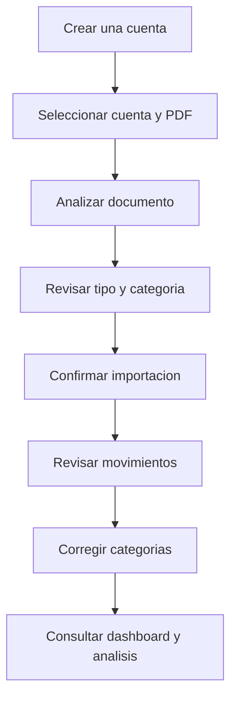
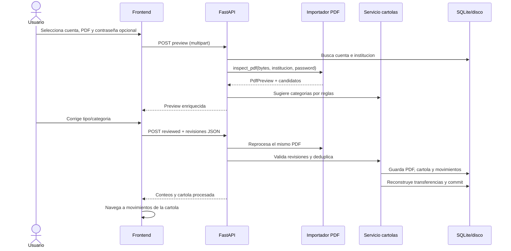
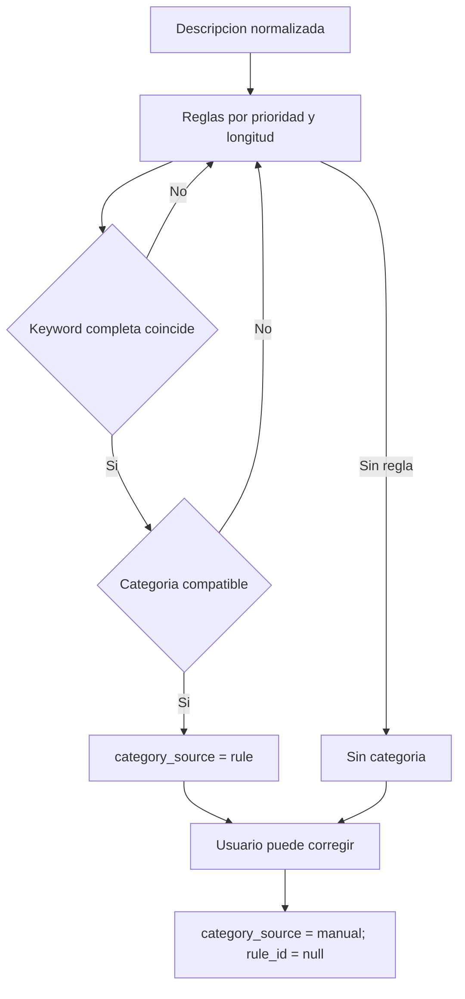
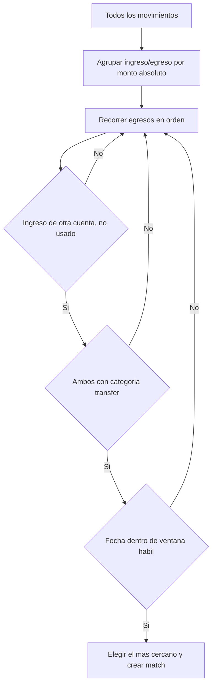
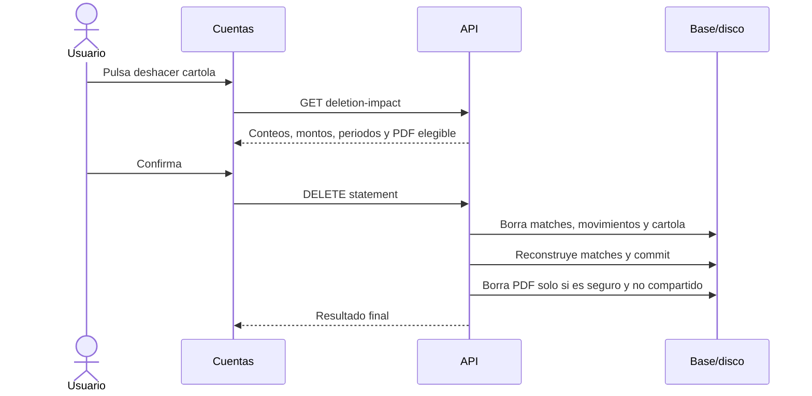

# Flujos de negocio

## Flujo recomendado de uso

## Crear y administrar cuentas

La cuenta se puede crear desde Dashboard o Configuracion. El formulario envia
nombre, institucion, tipo, ultimos cuatro digitos opcionales y CLP. La
institucion determina el parser PDF, por lo que no debe elegirse solo por su
nombre visual.

La edicion reemplaza todos los campos editables. La eliminacion solo funciona
si no existen referencias. Para eliminar una cuenta usada, primero deben
deshacerse sus importaciones; no hay borrado en cascada de cuenta.

## Analizar e importar una cartola

La preview y la importacion vuelven a parsear el archivo. No existe un token de
preview persistido; esto garantiza que las revisiones se comparen con candidatos
obtenidos nuevamente desde los bytes enviados.

### Validaciones previas

- Cuenta existente y con parser registrado.
- Archivo no vacio, extension `.pdf` y maximo 10 MB.
- Contraseña correcta cuando el PDF la exige.
- Texto seleccionable; no hay OCR.
- Marcadores de la institucion seleccionada.
- Periodo explicito o inferible desde movimientos.
- Fechas completas o inferibles desde el periodo.
- Monto distinto de cero y signo resoluble.
- Totales coincidentes en perfiles que los declaran.

Las filas individuales fallidas se devuelven en `parsing_errors` hasta un
maximo de diez. Un fallo estructural o de cuadratura aborta toda la preview.

### Persistencia y deduplicacion

Antes de insertar se valida que la misma cuenta no tenga una cartola con igual
checksum. Luego:

1. se eliminan candidatos duplicados por source key;
2. se calcula fingerprint de cada ocurrencia;
3. se comparan conteos con movimientos existentes de la misma cuenta;
4. se crea la cartola en estado pendiente;
5. se insertan solo ocurrencias nuevas;
6. se aplica categoria manual revisada o regla automatica;
7. se cambia la cartola a procesada;
8. se reconstruyen transferencias y se confirma la sesion.

## Categorizacion automatica y manual

La coincidencia rodea keyword y descripcion con espacios para no hacer match de
substrings arbitrarios. Por ejemplo, una regla corta no debe coincidir dentro de
otra palabra. Si prioridades empatan, gana la keyword mas larga y luego el ID
menor.

En la importacion revisada, cada fila enviada se considera override manual,
incluso si su `category_id` es nulo. En Movimientos, los cambios se mantienen en
estado local y se guardan todos al pulsar el boton.

## Deteccion de transferencias internas

La ventana acepta:

- mismo dia o un dia de diferencia;
- hasta cinco dias si entre ambas fechas no existe un dia habil bancario;
- fines de semana y feriados incluidos en el calendario local.

El match no cambia montos ni tipos. Agrega un registro derivado y hace que la
API marque ambos movimientos. Dashboard excluye esos IDs; Movimientos y Analisis
permiten mostrarlos o filtrarlos.

## Dashboard y analitica

### Dashboard

El backend calcula los tres indicadores y doce meses sin transferencias
internas. El frontend carga adicionalmente los movimientos del periodo para
categorias, inversiones, gasto diario y destacados.

El mes solicitado que no existe en los periodos disponibles no produce error:
el backend vuelve al periodo por defecto. Si no hay datos, usa el mes actual y
entrega doce meses en cero.

### Analisis

Analisis recibe todos los movimientos, incluidos internos, y aplica filtros en
cliente. Esto permite combinaciones inmediatas, pero significa que los totales
dependen de que la paginacion complete todo el historial.

## Deshacer una importacion

La operacion elimina categorizaciones manuales junto a los movimientos. No hay
papelera ni restauracion integrada. El PDF fuera de `backend/data/raw`, el
directorio mismo o un archivo compartido nunca se elimina automaticamente.

## Exportacion

La seccion Movimientos crea en el navegador un archivo `.md` con fecha,
descripcion, monto entero y categoria. Exporta el subconjunto que pasa los
filtros actuales, no necesariamente todo el historial, y aplica selecciones de
categoria aun no guardadas.

