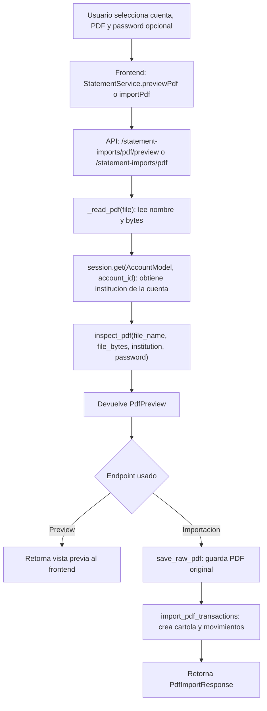
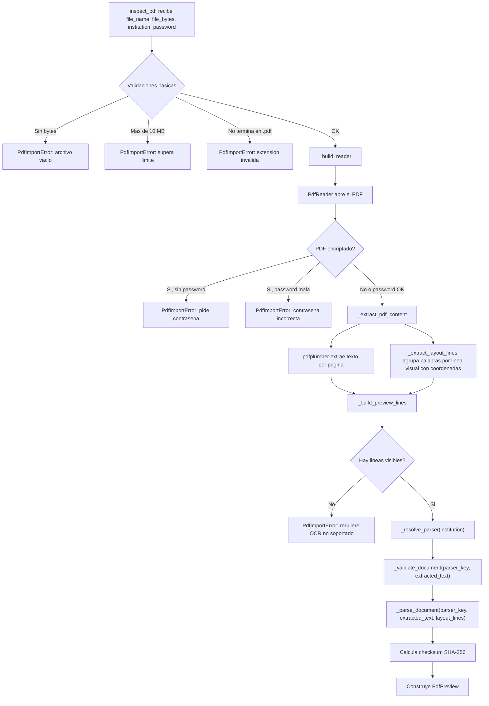
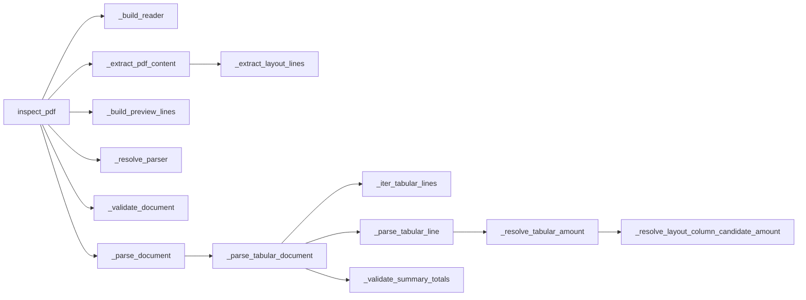
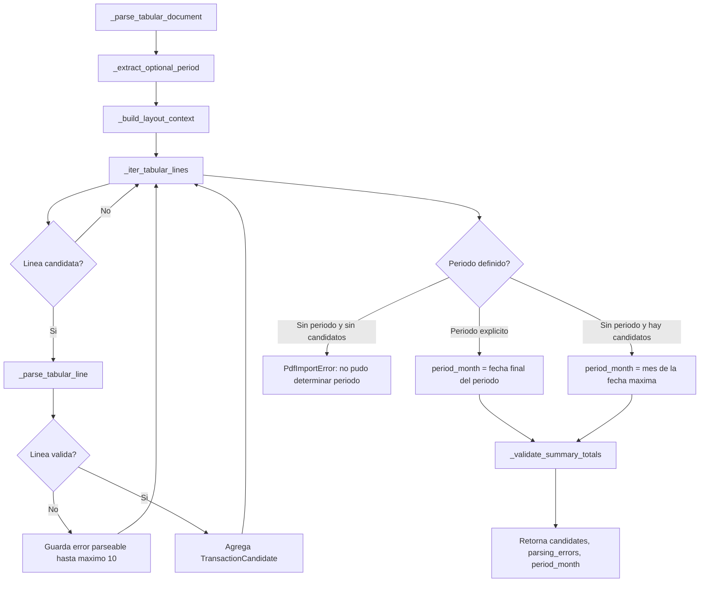
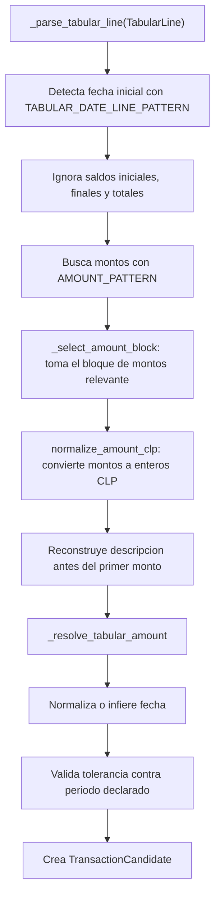
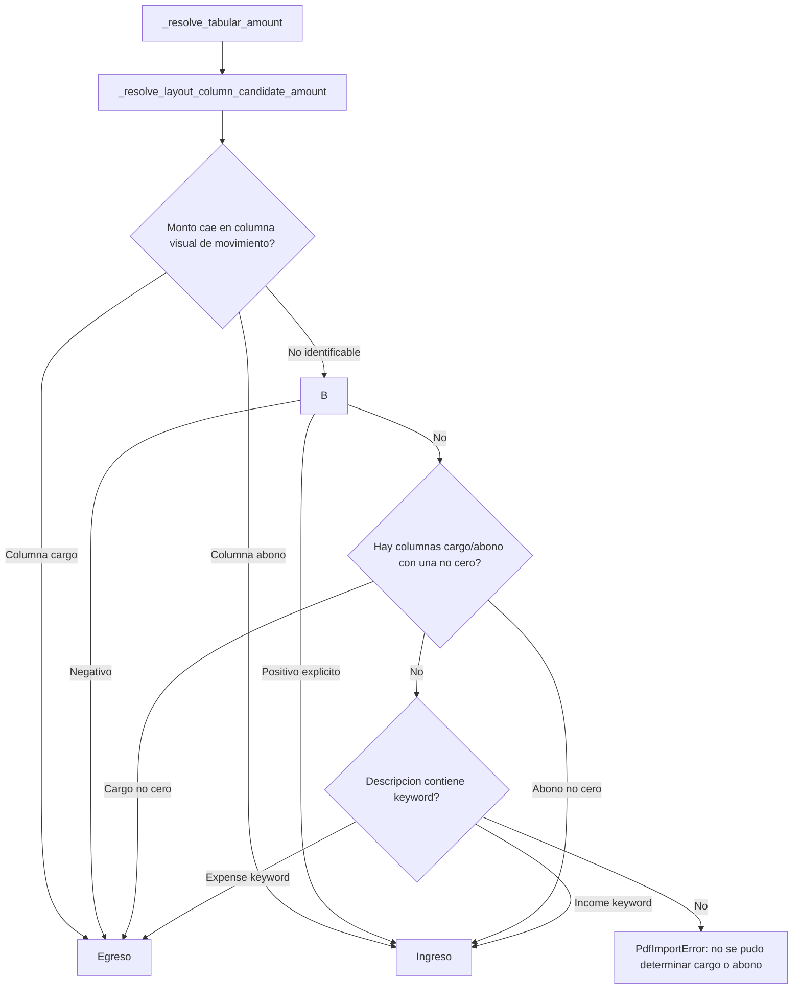
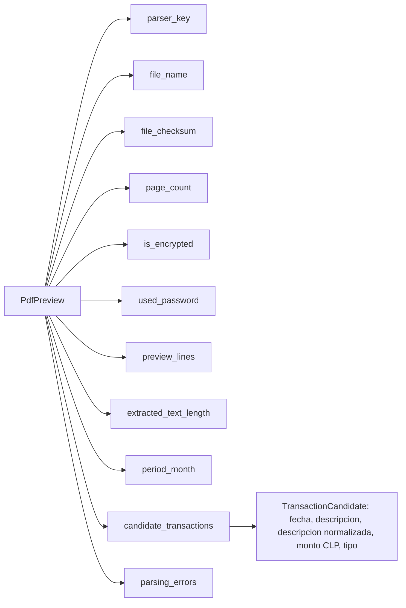
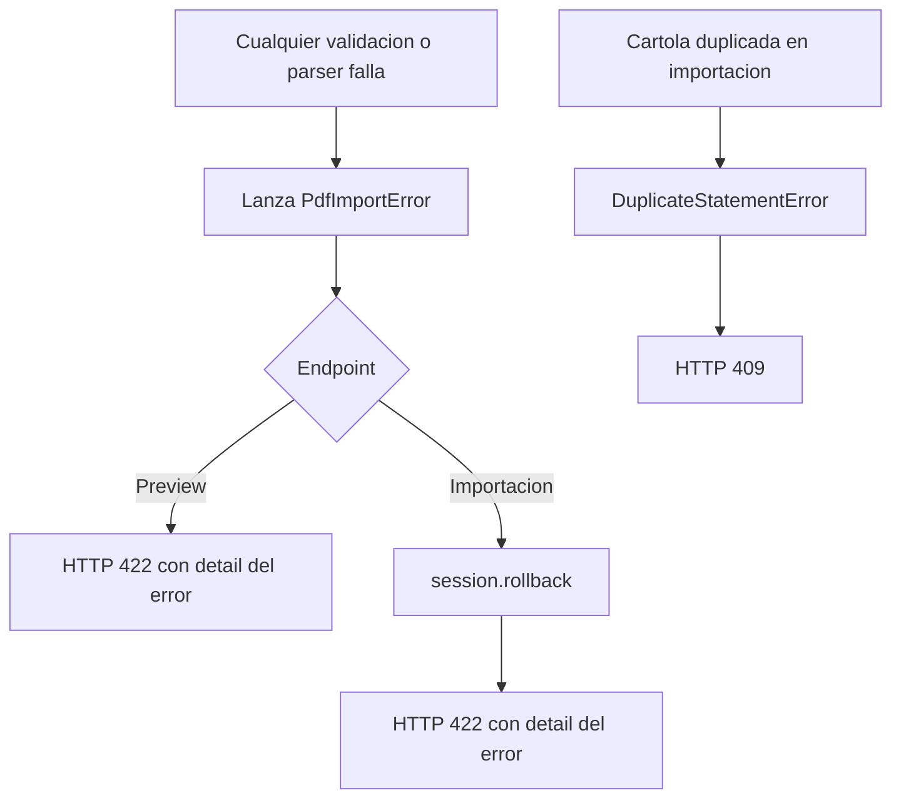

# Flujo visual de inspect_pdf

Este documento resume que pasa cuando se analiza una cartola PDF. El centro del
proceso esta en `backend/app/services/pdf_importer.py`, funcion `inspect_pdf`.

## Vista general

`inspect_pdf` solo inspecciona y parsea. No guarda el PDF, no crea cartolas y no
inserta movimientos. La persistencia ocurre despues, solo en el endpoint de
importacion real.

## Flujo interno de inspect_pdf

## Funciones principales

| Funcion | Que hace |
| --- | --- |
| `inspect_pdf` | Orquesta todo: valida archivo, extrae texto/layout, elige parser, parsea movimientos y arma el `PdfPreview`. |
| `_build_reader` | Abre el PDF con `pypdf`, valida si esta protegido y desencripta con password si corresponde. |
| `_extract_pdf_content` | Usa `pdfplumber` para sacar texto plano y lineas visuales posicionadas. |
| `_extract_layout_lines` | Agrupa palabras por coordenadas para saber en que columna cae cada monto. Esto ayuda especialmente a Santander. |
| `_build_preview_lines` | Limpia las primeras lineas no vacias para mostrarlas en la vista previa. |
| `_resolve_parser` | Traduce la institucion de la cuenta a un `ParserKey`. |
| `_validate_document` | Verifica que el texto tenga marcadores de la institucion esperada. |
| `_parse_document` | Busca el parser registrado y le pasa el texto y layout. |
| `_parse_tabular_document` | Parser generico para cartolas tabulares: periodo, filas, candidatos, errores y totales. |

## Subflujo del parser tabular

### Como se interpreta cada linea candidata

## Resolucion del signo del monto

El orden de decision es importante:

1. Coordenadas visuales del PDF, cuando existe perfil de columnas; los montos
   fuera de columnas cargo/abono, como saldos, se descartan.
2. Signo explicito en el texto.
3. Columnas cargo/abono cuando vienen dos montos.
4. Keywords del perfil de institucion.
5. Error si todavia es ambiguo.

## Salida de inspect_pdf

## Camino de errores

## Perfiles soportados

`PARSER_PROFILES` registra los parsers tabulares para:

- `BANCO_DE_CHILE`
- `BANCO_SANTANDER`
- `COPECPAY`
- `MERCADOPAGO`
- `BANCO_ESTADO`
- `BANCO_FALABELLA`

Cada perfil define marcadores de documento, keywords de ingreso/egreso y, cuando
aplica, reglas especiales como lineas de continuacion, marcadores de inicio/fin,
extraccion de totales y columnas visuales.

### Banco Falabella: cuenta corriente

El perfil `FALABELLA_PROFILE` admite la **Cartola de Movimientos de Cuenta
Corriente**. El logo puede estar rasterizado y no aparecer en el texto extraido;
su validador comprueba conjuntamente el titulo, el producto, el periodo,
`Saldo Disponible`, `Saldo Contable`, `Listado de movimientos` y el encabezado
`FECHA DESCRIPCIÓN CARGO ABONO SALDO`. Rechaza encabezados de otras instituciones
y no admite estados de cuenta CMR.

`movement_columns_pattern` captura desde el final de cada fila la descripcion,
cargo, abono y saldo. Cada celda monetaria lleva `$` y la celda vacia usa `-`.
Se aceptan miles con comas o puntos mediante el normalizador CLP existente;
los decimales distintos de cero y las filas con cargo y abono simultaneos se
reportan como errores. El signo depende de la columna, no de la descripcion.
Los saldos se validan pero no se importan como movimientos ni se comparan con
el saldo disponible del encabezado, que puede representar otro momento.

El periodo `Periodo de movimientos DD/MM/AAAA al D/MM/AAAA` admite dias y meses
de uno o dos digitos. Se usa para validar las fechas de las transacciones.
`period_from_transactions` asigna el mes del ultimo movimiento, ya que el fin
del rango de consulta puede estar en el futuro. Sin movimientos se conserva
el mes final declarado; la interfaz no permite confirmar una importacion vacia.

El perfil reutiliza la vista previa, revision, categorizacion, identificadores
por fila y proteccion contra duplicados del flujo comun. Las pruebas usan datos
sinteticos y PDFs generados en memoria, sin incluir informacion del titular.
